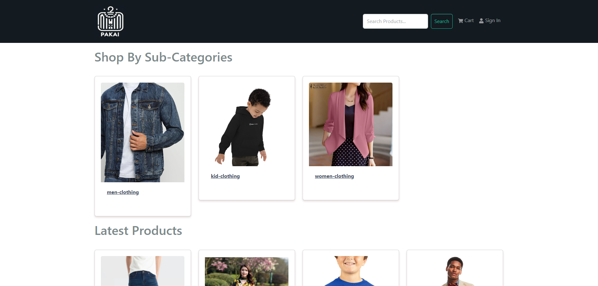
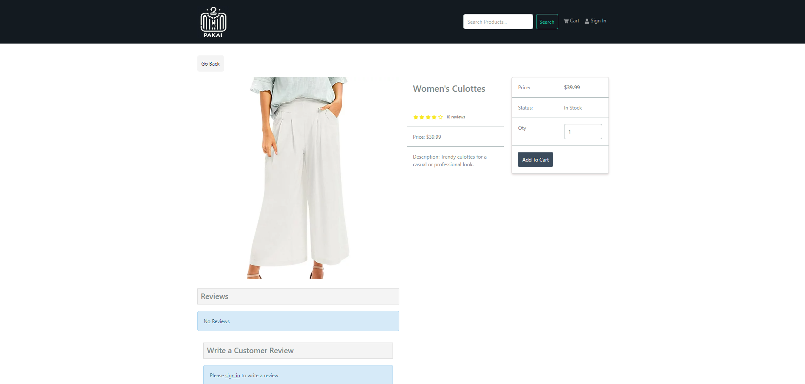
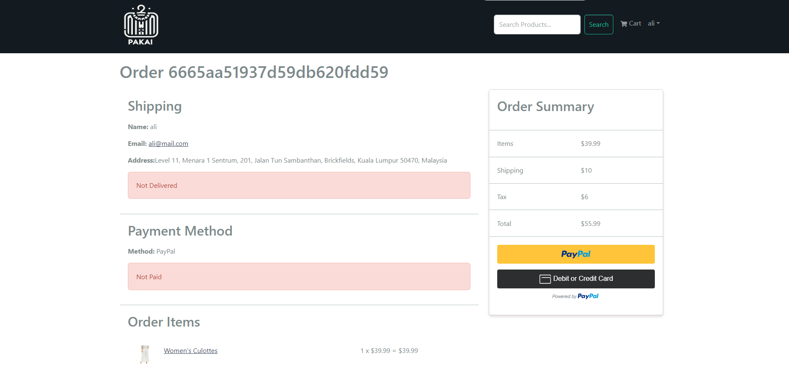

# Pakai eCommerce Platform

> an eCommerce platform.





## Features

- Shopping cart
- Product reviews and ratings
- Products carousel
- Product search feature
- User profile with orders
- Checkout process (shipping, payment method, etc)
- PayPal API
- Database seeder (products & users)

### How to run 

```
In main folder, run npm install
Then cd frontend
Then run npm install again
Then back to main folder, run npm run dev
```

## Build & Deploy
```
# Create frontend prod build
cd frontend
npm run build
```

### Seed Database
How to seed the database into your MongoDB Atlas
```
# Import data
npm run data:import
```
